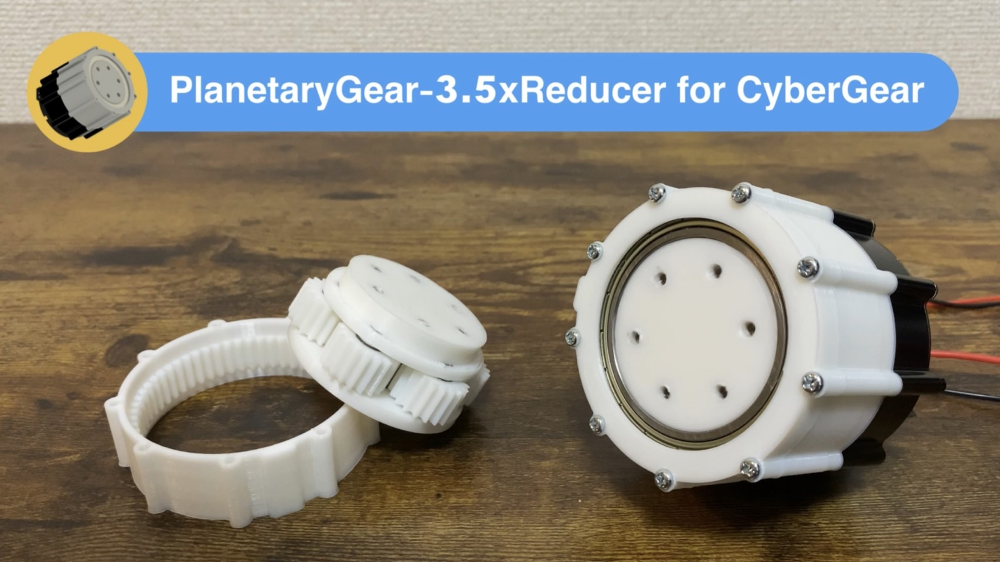
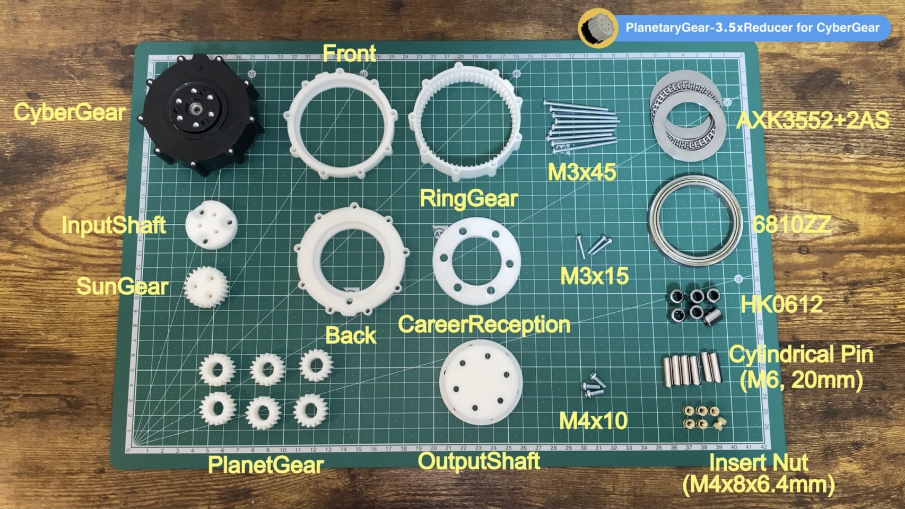

# PlanetaryGear-3.5xReducer for CyberGear 

Contains the design, documentation, and implementation details for an additional gearbox compatible with the CyberGear motor. It enhances the CyberGear motor's functionality with extra reduction capabilities, making it suitable for applications requiring higher torque.

Detailed operational instructions, assembly procedures, and simple torque tests are available in our YouTube video linked below. This video also provides practical insights into the assembly and testing processes.

https://youtu.be/O-cvOlKmTHc

## Technical Specifications
* Internal Gear Teeth: 60
* Sun Gear Teeth: 24
* Planet Gear Teeth: 18
* Reduction Ratio: 1:3.5
## Performance
The experimental torque is confirmed up to 35Nm, though calculations suggest that the gearbox could theoretically output up to 42Nm, compared to the CyberGear's rated maximum torque of 12Nm.
## 3D Printing Requirements
Parts required to be 3D printed are stored in the 3d_models folder. Notably, the file PlanetGear.stl needs to be printed six times.
## Parts List
The following parts must be purchased for assembly:
* CyberGear Main Unit: x1
* Bearings (6810ZZ): x1
* Bearings (HK0612): x6
* Cylindrical Pin (M6, 20mm): x6
* Thrust Bearing (AXK3552+2AS): x1
* Insert Nut (M4x8x6.4mm): x6
* Screws (M3x45mm): x9
* Screws (M3x15mm): x3
* Screws (M4x10mm): x3

## Comprehensive Assembly Overview
For a full understanding of all the components that need to be assembled, including those printed from the 3d_models directory, refer to the image below:

## Software for Operational Testing
The operational testing was conducted using a program available under the MIT License, which can be found here: CyberGear M5 Program (https://github.com/project-sternbergia/cybergear_m5).
